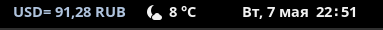

# USD to RUB Gnome top panel viewer
```
That simple Gnome shell (v45) extension shows USD to Russian RUB exchange rate on the left center part of Gnome top panel. Exchange rate updates every 30 seconds. Compatible with Gnome 45.
```
This is extension is a modified  version of https://github.com/arifesat/USD-TRY-GShell extension to show USD to RUB instead of USD to TRY. 
## Preview

## Q&A 
| Question | Tip |
| ------------- | ------------- |
| How to install?  | Download via Gnome Extension Store: https://extensions.gnome.org/extension/6958/usd-to-rub-viewer/  |
| How to launch? |To restart GNOME Shell in X11, pressing Alt+F2 to open the Run Dialog and enter restart (or just r). In Wayland Logout and Login agaian.|
|How to run this extension manually?|0. ```Download the archive extension``` 1. ```gnome-extensions install usd-rub-er-gse@c0mr8.github.com.shell-extension.zip``` 2. ```Press Alt+F2 to open Run Dialog and enter R for restart shell``` 3.```gnome-extensions enable usd-rub-er-gse@c0mr8.github.com```|


